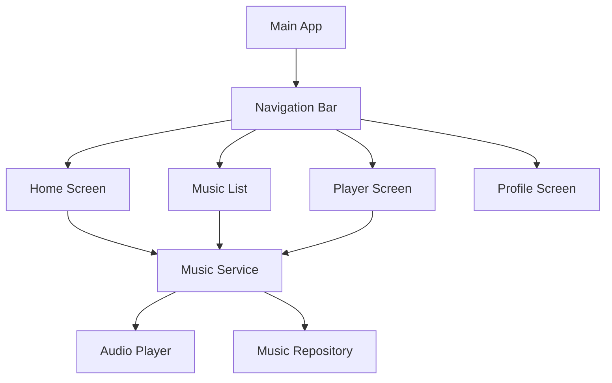

## Product Overview

一个基于Flutter开发的网易云音乐移动应用，专为新手学习者设计，提供音乐播放、浏览和管理功能。

## Core Features

- 修复现有代码中的未使用HomeScreen类问题
- 实现底部导航栏，支持多个页面切换
- 开发音乐播放功能，包括播放、暂停、上一首、下一首
- 设计音乐列表页面，展示歌曲信息
- 创建播放器界面，显示当前播放歌曲详情和控制按钮
- 实现基本的用户界面交互和响应式布局

## Tech Stack

- 移动开发框架: Flutter (Dart)
- 状态管理: Provider或Riverpod
- 音频播放: just_audio包
- 网络请求: dio或http包
- UI组件: Material Design 3
- 本地存储: shared_preferences
- 架构模式: MVC/MVVM

### 系统架构

### 模块划分

- **导航模块**: 底部导航栏和路由管理
- **音乐服务模块**: 音频播放控制和状态管理
- **界面模块**: 各页面的UI组件
- **数据模块**: 音乐数据和本地存储

### 数据流

采用网易云音乐的设计风格，使用深色主题和渐变色彩，营造沉浸式音乐体验。界面设计简洁现代，注重用户体验和视觉美感。

## Agent Extensions

### SubAgent

- **code-explorer**
- Purpose: 搜索和分析现有Flutter项目代码结构，定位未使用的HomeScreen类和其他代码问题
- Expected outcome: 识别项目中的代码问题和需要修复的部分